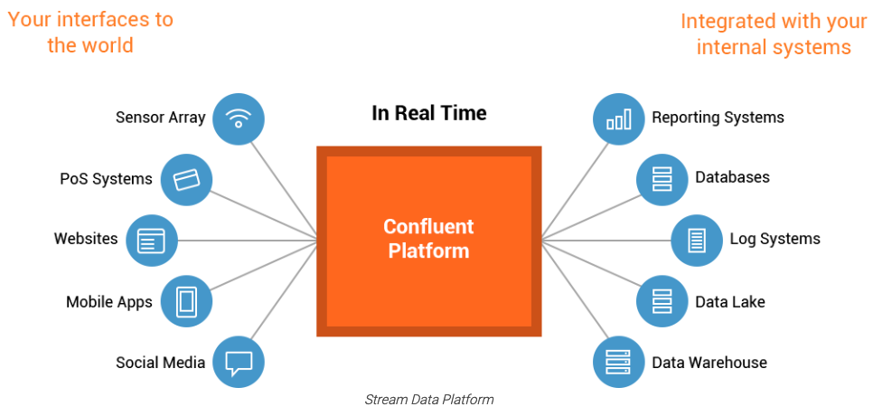
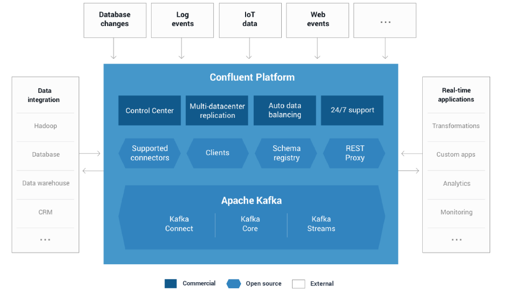

# 1.1：关于

### 1: confluent kafka整体架构图

```
Confluent Platform是一个流媒体平台，通过一个可靠的高性能系统，您可以组织和管理来自多个不同来源的数据
```





### 2: confluent kafka 含括什么



- confulent connectors
- confluent clients
- Confluent schema registry
- confluent rest proxy
- automatic data balancing (企业版)
- Multi-datacenter replication(企业版)
- confluent control center(企业版)
- Jms client(企业版)